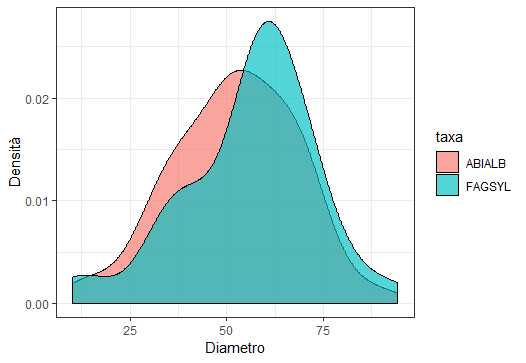
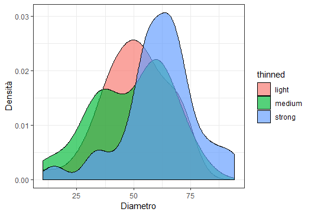
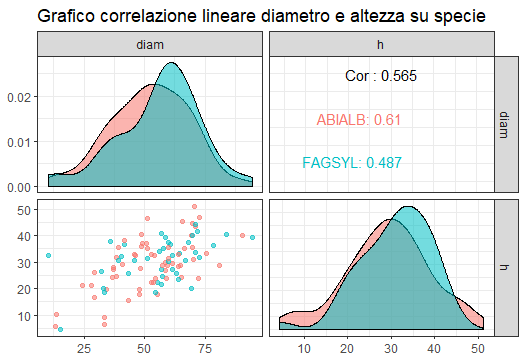
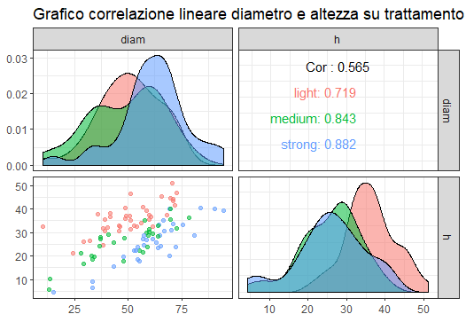

# Progetto-esame-2018

## Samantha Benucci
## Matricola 7000947
## Scienze e tecnologie dei sistemi forestali
&nbsp;
### Grafico esplorativo della densità tra diametro e specie

&nbsp;
### Grafico esplorativo della densità tra diametro e trattamento colturale

&nbsp;
### Metriche generali
 |  **diam**   |     **h**      |  **taxa**  | **thinned** |
 |-------------|----------------|------------|-------------|
 | Min: 10.15  | Min: 4.374     | ABIALB: 60 | light: 39   |
 | Mean: 53.69 | Mean: 29.858   | FAGSYL: 40 | medium: 29  |
 | Max: 94.30  | Max: 51.231    |            | strong: 32  |
 
 &nbsp;
 ### Metriche specie (diametro)
 | **taxa** | **max** | **mean** | **standard deviation** |
 |----------|---------|----------|------------------------|
 |  ABIALB  |   90.3  |   52.1   |         16.0           |
 |  FAGSYL  |   94.3  |   56.1   |         17.1           |
 
 &nbsp;
### Metriche specie (altezza)
 | **taxa** | **max** | **mean** | **standard deviation** |
 |----------|---------|----------|------------------------|
 |  ABIALB  |   51.2  |   29.2   |         9.87           |
 |  FAGSYL  |   44.4  |   30.8   |         8.15           |
 
 &nbsp;
 ### Metriche trattamento colturale (diametro)
 | **taxa** | **max** | **mean** | **standard deviation** |
 |----------|---------|----------|------------------------|
 |  light   |   72.7  |   50.7   |         14.4           |
 |  medium  |   78.4  |   49.1   |         17.1           |
 |  strong  |   94.3  |   61.4   |         16.1           |
 
 &nbsp;
### Metriche trattamento colturale (altezza)
 | **taxa** | **max** | **mean** | **standard deviation** |
 |----------|---------|----------|------------------------|
 |  light   |   51.2  |   36.2   |         6.45           |
 |  medium  |   40.0  |   25.8   |         7.76           |
 |  strong  |   40.3  |   25.8   |         9.16           |
 
 &nbsp;
 
### Grafico correlazione lineare specie

### Grafico correlazione lineare trattamento colturale

### Valori correlazione lineare
#### p-Value = 9.454e-10
#### R^2 = 0.3188 (multiple) - 0.3118 (adjusted)
